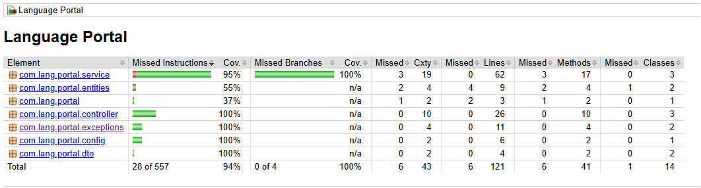

# Lang Portal - API Documentation

## Description
This project is an API built with Java, Spring Boot, and SQLite3, designed to facilitate language learning through study sessions and vocabulary management.

## How to Run the Project
1. Make sure you have Java and Maven installed on your machine.
2. Clone the repository:
   ```bash
   git clone <https://github.com/NahuelRocha/gen-ai-bootcamp-2025.git>
   cd lang-portal
   cd backend-spring
   ```
3. Run the following command to start the application:
   ```bash
   mvn spring-boot:run
   ```

## How to Run Tests
1. Make sure you have JUnit and other testing dependencies configured.
2. Run the following command to execute the tests:
   ```bash
   mvn clean verify
   ```
3. 

## Entity Diagram

Here is the entity diagram for the project:

[Entity Diagram](./entity-diagram.mmd)

## API Endpoint Documentation

### GroupController
- **Route:** `/groups`
  - **Method Type:** GET
  - **Expected Request:** `?page=1` (optional query parameter for pagination)
  
- **Route:** `/groups/{id}`
  - **Method Type:** GET
  - **Expected Request:** 
    - Path Variable: `id` (the ID of the group)
    - Query Parameters: 
      - `page` (default: 1)
      - `sortBy` (default: "english")
      - `order` (default: "asc")

### StudySessionController
- **Route:** `/study_sessions`
  - **Method Type:** POST
  - **Expected Request:** 
    - Body: `StudySessionRequestDTO` (must be valid)
  
- **Route:** `/study_sessions/{id}/review`
  - **Method Type:** POST
  - **Expected Request:** 
    - Path Variable: `id` (the ID of the study session)
    - Body: `WordReviewRequestDTO` (must be valid)

- **Route:** `/study_sessions/last`
  - **Method Type:** GET
  - **Expected Request:** None

### WordController
- **Route:** `/words`
  - **Method Type:** GET
  - **Expected Request:** 
    - Query Parameters: 
      - `page` (default: 1)
      - `sortBy` (default: "english")
      - `order` (default: "asc")

- **Route:** `/words/count`
  - **Method Type:** GET
  - **Expected Request:** None