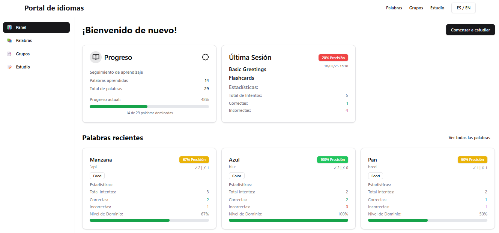

# Lang Portal - Frontend API Documentation

## Project Description

The Language Learning Portal is a prototype designed for a language learning school, serving four primary functions:

1. **Vocabulary Inventory**: A comprehensive repository of vocabulary that learners can explore and study.
2. **Score Tracking**: A record-keeping system that evaluates learners' performance on vocabulary practice, providing feedback on correct and incorrect answers.
3. **Groups**: This feature is responsible for grouping and categorizing words into various categories such as "Greetings," "Family Members," "Adjectives," "Verbs," etc. Additionally, it provides insights into the user's proficiency with each group of words.
4. **Learning App Launchpad**: A centralized platform that enables users to access various interactive learning applications seamlessly.

### Main Technologies Used

This project utilizes several key technologies to enhance functionality and user experience:

- **React**: A library for building user interfaces.
- **Vite**: A fast build tool and development server.
- **TypeScript**: Adds static typing to JavaScript for better code quality.
- **Tailwind CSS**: A utility-first CSS framework for rapid UI development.
- **shadCN**: A UI component library built on top of Tailwind CSS for faster development.
- **Axios**: A promise-based HTTP client for API requests.
- **Framer Motion**: A library for animations in React.
- **React Router**: Enables navigation between components.
- **Zustand**: A simple state management solution for React.

### How to Run the Project

Follow these steps to set up and run the Language Learning Portal:

1. **Clone the Repository**: 
   ```bash
   git clone <repository-url>
   ```
2. **Navigate to the Project Directory**
   ```bash
   cd lang-portal/frontend-react
   ```
3. **Install Dependencies**
   ```bash
   npm install
   ```
4. **Start the Development Server**
   ```bash
   npm run dev
   ```
5. You can view it in your browser at http://localhost:5173


## Dashboard Screenshot



## Project Video

[Watch the Project Video](https://youtu.be/0NTRmIJqjqk)


