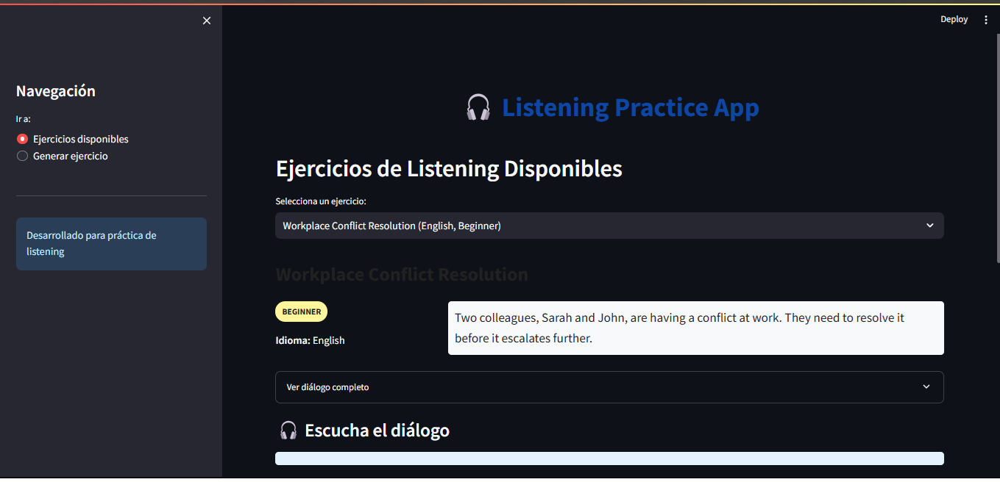

# Listening Learning App

A full-stack application designed to help users practice and improve their listening comprehension in multiple languages. The app generates realistic dialogues with audio, evaluates user comprehension through interactive quizzes, and provides immediate feedback.



## 🚀 Features

- **Multilingual Support**: Practice listening in English, Spanish, French, German, and Italian
- **Difficulty Levels**: Choose between Easy, Intermediate, and Hard exercises
- **AI-Generated Content**: Fresh dialogue scenarios created on demand
- **Text-to-Speech**: High-quality audio generation for all dialogues
- **Interactive Quizzes**: Multiple-choice questions to test comprehension
- **Immediate Feedback**: Track your progress with automatic scoring
- **User-Friendly Interface**: Clean and accessible design with Streamlit

## 🛠️ Technology Stack

### Backend
- **FastAPI**: Modern, high-performance web framework
- **SQLAlchemy**: SQL toolkit and ORM
- **LangChain**: Framework for developing LLM-powered applications
- **Mistral 7B**: Optimized language model for dialogue generation
- **SpeechT5**: Text-to-speech model for natural audio synthesis
- **Uvicorn**: ASGI server to run the FastAPI application

### Frontend
- **Streamlit**: Data-focused web application framework for interactive UI
- **Pandas**: Data manipulation and analysis
- **Requests/Httpx**: HTTP clients for API communication

## 📦 Installation

### Prerequisites
- Python 3.9+
- Pip
- Git

### Clone the Repository
```bash
git clone https://github.com/yourusername/listening-learning-app.git
cd listening-learning-app
```

### Backend Setup
1. Create and activate a virtual environment:
```bash
python -m venv venv
source venv/bin/activate  # On Windows: venv\Scripts\activate
```

2. Install dependencies:
```bash
pip install -r backend/requirements.txt
```

3. Download the Mistral model file:
```bash
mkdir -p models
wget https://huggingface.co/TheBloke/Mistral-7B-Instruct-v0.1-GGUF/resolve/main/mistral-7b-instruct-v0.1.Q4_K_M.gguf -P models/
```

4. Create a `.env` file in the backend directory:
```
API_TITLE="Listening Learning API"
API_DESCRIPTION="API for generating and managing listening exercises"
API_VERSION="1.0.0"
DATABASE_URL="sqlite+aiosqlite:///./listening_app.db"
AUDIO_DIR="./static/audio"
```

5. Start the backend server:
```bash
cd backend
python -m app.main
```

### Frontend Setup
1. Open a new terminal and activate the virtual environment
2. Install Streamlit requirements:
```bash
pip install -r frontend/requirements.txt
```

3. Create a `.env` file in the frontend directory:
```
API_URL="http://localhost:8000/api"
```

4. Run the Streamlit app:
```bash
cd frontend
streamlit run app.py
```

5. Open your browser at `http://localhost:8501`

## 🧠 How It Works

1. **Content Generation**: The application uses Mistral 7B, a language model optimized for CPU usage, to generate dialogues and comprehension questions based on user-selected parameters.

2. **Audio Synthesis**: The SpeechT5 model converts text dialogues into natural-sounding speech, segmenting longer texts and adding appropriate pauses.

3. **User Interaction**: The Streamlit frontend provides an intuitive interface for exercise selection, audio playback, and answering comprehension questions.

4. **Feedback System**: The app evaluates user responses and provides immediate feedback with correct answers and scoring.

## 🔧 Configuration Options

### Backend Environment Variables
- `API_TITLE`: Title of the API
- `API_DESCRIPTION`: Description of the API
- `API_VERSION`: Version number
- `DATABASE_URL`: SQLite database connection string
- `AUDIO_DIR`: Directory for storing generated audio files

### LLM Configuration
The Mistral model can be configured in `app/services/llm_service.py`:
```python
config={
    'max_new_tokens': 1024,
    'context_length': 1024,
    'temperature': 0.2,
    'threads': 6,  
    'batch_size': 1
}
```

## 📝 License

This project is licensed under the MIT License - see the LICENSE file for details.

## 🙏 Acknowledgements

- [Mistral AI](https://mistral.ai/) for the Mistral 7B model
- [Microsoft](https://github.com/microsoft/SpeechT5) for the SpeechT5 TTS model
- [Anthropic](https://www.anthropic.com/) for Claude, which helped generate documentation
