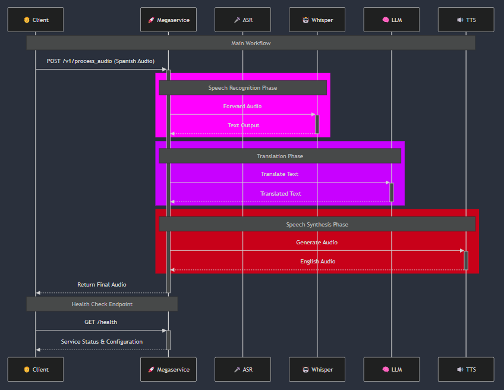

# OPEA Comps GenAI Workload Orchestrator

This project demonstrates the orchestration of AI workloads using Docker containers to run ASR, LLM, and TTS services in a coordinated manner. The solution implements a Megaservice that integrates and orchestrates these three services to receive Spanish audio as input and return correctly translated English audio as output.

---

## Table of Contents

- [Project Overview](#project-overview)
- [Project Video Linkedin](#project-video-linkedin)
- [Architecture](#architecture)
  - [Sequence Diagram](#sequence-diagram)
- [Usage and Endpoints](#usage-and-endpoints)
- [Hardware and AI Models](#hardware-and-ai-models)
- [Execution Instructions](#execution-instructions)

---

## Project Overview

This project is designed to process Spanish audio input and return an English audio output. It leverages three main AI services:
- **ASR (Automatic Speech Recognition):** Converts Spanish audio into text.
- **LLM (Large Language Model):** Translates the text from Spanish to English.
- **TTS (Text-to-Speech):** Converts the translated text into audio.

A Megaservice orchestrates these services by exposing a single endpoint that manages the complete workflow.

---

## Project Video Linkedin

[Watch the Project Video](https://www.youtube.com/watch?v=FsplQ4NezCo)

## Architecture

The system is composed of the following services:

- **Whisper Service:**  
  A dependency service that converts audio to text using the `whisper-small` model.

- **ASR Service:**  
  Handles the transcription of Spanish audio by forwarding requests to the Whisper Service.

- **LLM Service:**  
  Translates the transcribed text into English using the `neural-chat-7b` model.

- **TTS Service:**  
  Converts the translated text into audio using the `speecht5_tts` model.

- **Megaservice:**  
  Orchestrates the entire workflow, receiving an audio file, sequentially invoking ASR, LLM, and TTS services, and returning the final audio output.

### Sequence Diagram

Below is a Mermaid diagram illustrating the architecture and communication flow between the services:


 [Architecture Diagram](./architecture-diagram.mmd)

## Usage and Endpoints

### Main Endpoint

 POST /v1/process_audio
 Receives an audio file (in Spanish) and returns the translated audio (in English).

### Workflow:

 - The audio file is sent to the ASR Service to obtain a transcription.
 - The transcription is forwarded to the LLM Service for translation.
 - The translated text is sent to the TTS Service to generate the audio.
 - The Megaservice orchestrates these calls and returns the final audio file.

### Health Check Endpoint

 GET /health
 Returns the health status of the Megaservice along with the orchestrator configuration, showing the registered services and defined flow.

## Hardware and AI Models

### Hardware Used

- Operating System: Windows 11 Pro
- Processor: AMD Ryzen 5 5600G with Radeon Graphics (4.20 GHz)
- Memory: 16 GB RAM (15.3 GB usable)

### AI Models Used

- ASR (Speech to Text): whisper-small
- LLM (Text Translation): neural-chat-7b
- TTS (Text to Speech): speecht5_tts
 These models are optimized to run on CPU, making them suitable for an in-house infrastructure.

## Execution Instructions   

### - Clone the Repository:

```bash
git clone https://github.com/opea-ai/opea-comps.git
cd opea-comps
```

### - Build and Deploy Containers with Docker Compose:

```bash
docker-compose up --build
```

This command will start the following services on the opea-network:

- whisper-service
- asr-service
- llm-service
- tts-service
- megaservice

### - Test the Main Endpoint:

Send an audio file (in Spanish) to:

```bash
curl -X POST -F file=@audio.wav http://localhost:8000/
```

### - Test the Health Check Endpoint:

Send a GET request to the health check endpoint to verify the Megaservice is running:

```bash
curl -X GET http://localhost:8000/health
```
