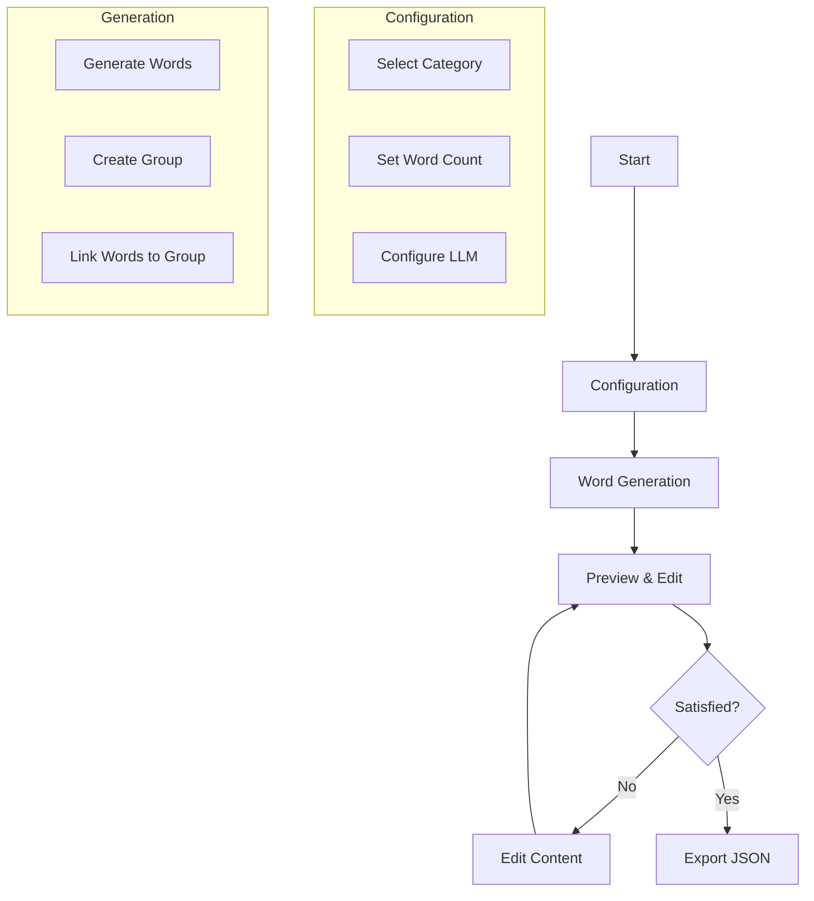

# Instructions for Building Vocab Importer Tool

Dear Windsurf IDE,

Please create a Streamlit-based vocabulary generation tool with the following specifications:

## Project Overview
Create a Streamlit application that generates vocabulary content for a language learning platform. The tool should generate English words with Spanish translations and group them into categories.

## Data Structures
Please respect these exact JSON structures:

1. Word Entity:
```json
{
    "id": 14,
    "english": "Green",
    "spanish": "Verde",
    "pronunciation": "ɡriːn",
    "parts": "{\"type\": \"color\", \"category\": \"secondary\"}",
    "correctCount": 0,
    "wrongCount": 0
}
```

2. Group Entity:
```json
{
    "id": 1,
    "name": "Basic Greetings",
    "wordsCount": 5
}
```

## Application Structure

Please create this exact project structure:
```
vocab-importer/
├── app.py               # Main Streamlit application
├── requirements.txt     # Project dependencies
├── services/
│   ├── llm.py          # Ollama integration
│   ├── validator.py    # Data validation
│   └── exporter.py     # JSON export functionality
└── utils/
    └── helpers.py      # Utility functions
```

## Required Dependencies
Add these to requirements.txt:
```
streamlit==1.32.0
pandas==2.2.0
pydantic==2.6.1
requests==2.31.0
python-dotenv==1.0.0
```

## UI Flow Diagram


## Main Application Implementation
Create app.py with these features:

1. Sidebar Configuration:
```python
def create_sidebar():
    st.sidebar.title("Configuration")
    category = st.sidebar.selectbox(
        "Select Category",
        ["Basic Greetings", "Numbers", "Colors", "Family Members", "Food and Drinks"]
    )
    word_count = st.sidebar.slider("Number of Words", 5, 20, 10)
    return category, word_count
```

2. Main Interface with two tabs:
   - Generate Tab: For creating new vocabulary
   - Import Tab: For importing existing JSON files

3. Generation Form Structure:
```python
def create_generation_form():
    st.header("Generate Vocabulary")
    
    # Group Configuration
    group_name = st.text_input("Group Name")
    
    # Generation Controls
    if st.button("Generate Words"):
        with st.spinner("Generating vocabulary..."):
            # Generation logic here
            pass
            
    # Preview Area
    st.subheader("Preview")
    # Display generated content in editable table
```

4. Export Functionality:
```python
def export_to_json(words, group):
    # Create proper JSON structure
    export_data = {
        "words": words,
        "group": group
    }
    return json.dumps(export_data, indent=2)
```

## LLM Integration
Implement Ollama integration with this prompt template:
```python
PROMPT_TEMPLATE = """
Generate {word_count} words for category '{category}' in English with Spanish translations.
Each word should include:
1. English word
2. Spanish translation
3. IPA pronunciation
4. Parts information as JSON

Output format for each word:
{
    "english": "<word>",
    "spanish": "<translation>",
    "pronunciation": "<ipa>",
    "parts": {"type": "<type>", "category": "<category>"}
}

The words should be appropriate for {category} category.
"""
```

## Required Features

1. Word Generation:
   - Generate English-Spanish word pairs
   - Include IPA pronunciation
   - Generate appropriate parts JSON
   - Validate all fields

2. Group Management:
   - Create groups based on category
   - Auto-calculate word counts
   - Link words to groups

3. Preview & Edit:
   - Display in editable table
   - Allow modifications
   - Validate changes

4. Export:
   - Export to JSON file
   - Match database schema
   - Include all required fields

## Data Validation Rules

1. Words must have:
   - Non-empty english and spanish fields
   - Valid IPA pronunciation
   - Valid JSON in parts field
   - Unique english words within group

2. Groups must have:
   - Non-empty name
   - Correct word count
   - Unique name

## UI Components to Create

1. Main Interface:
```python
def main():
    st.title("Vocab Importer Tool")
    
    # Sidebar
    category, word_count = create_sidebar()
    
    # Main content
    tab1, tab2 = st.tabs(["Generate", "Import"])
    
    with tab1:
        create_generation_tab(category, word_count)
    
    with tab2:
        create_import_tab()
```

2. Preview Table:
```python
def create_preview_table(data):
    df = pd.DataFrame(data)
    edited_df = st.data_editor(df)
    return edited_df
```

3. Export Button:
```python
def create_export_button(data):
    if st.button("Export to JSON"):
        json_str = export_to_json(data)
        st.download_button(
            "Download JSON",
            json_str,
            file_name="vocabulary.json",
            mime="application/json"
        )
```

## Error Handling

1. Implement validation feedback:
```python
def validate_data(words, group):
    errors = []
    # Validation logic
    if errors:
        st.error("\n".join(errors))
        return False
    return True
```

2. Handle LLM errors with retry mechanism:
```python
def generate_with_retry(prompt, max_retries=3):
    for attempt in range(max_retries):
        try:
            return generate_vocabulary(prompt)
        except Exception as e:
            if attempt == max_retries - 1:
                st.error(f"Generation failed: {str(e)}")
                return None
```

## Implementation Notes

1. Use st.session_state for managing state between reruns
2. Implement progressive loading for large datasets
3. Add input validation before generation
4. Include clear error messages
5. Add loading indicators for long operations

Please generate the complete application according to these specifications. The application should be fully functional and follow all Streamlit best practices.

End of instructions.