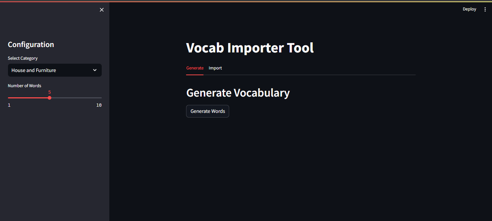
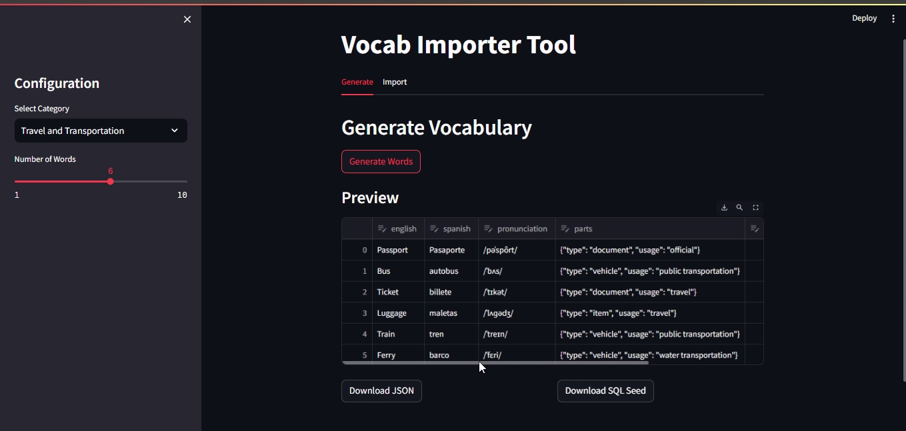

# Vocab Importer

## Description
Vocab Importer is a tool designed to generate vocabulary based on user-defined categories and quantities. It facilitates the creation of words along with their translations, pronunciations, and other characteristics necessary for populating an SQLite database. This tool is essential for quickly populating a language learning application prototype.

## Business Goal
The prototype of the language learning app is built, but we need to quickly populate the application with words and word groups so students can begin testing the system. Currently, there is no interface for manually adding words or word groups, making the process tedious. This tool aims to streamline vocabulary generation and management.

## Features
- Generate vocabulary based on specified categories, quantities, and the Word entity of our application.
- Generates a SQL file which contains optimized sentences based on the generated words that we can download to efficiently populate the database without effort
- Export generated vocabulary to JSON format for later import.
- Import JSON files containing vocabulary data.
- Utilize an LLM (Ollama2 7b model) for generating target words and word groups.
- User-friendly interface built with Streamlit.

## Technical Stack
- **Frontend**: Streamlit
- **LLM**: Ollama2 7b model (local deployment)
- **Database**: SQLite3

## Hardware Specifications
- **Operating System**: Windows 11 Pro
- **RAM**: 16.0 GB (15.3 GB usable)
- **Processor**: AMD Ryzen 5 5600G with Radeon Graphics, 4.20 GHz
- **Graphics Card**: None

## Usage
1. Run the Streamlit application.
2. Define the categories and quantities for the vocabulary generation.
3. Generate the vocabulary.
4. Export the vocabulary to JSON or import existing JSON files.
5. Download the SQL file generated by the LLM.

## Installation
To set up the project, follow these steps:
1. Clone the repository:
   ```bash
   git clone https://github.com/NahuelRocha/gen-ai-bootcamp-2025.git
   ```
2. Navigate to the project directory:
   ```bash
   cd gen-ai-bootcamp-2025/vocab-importer
   ```
3. Install the dependencies:
   ```bash
   pip install -r requirements.txt
   ```
4. Run the Streamlit application:
   ```bash
   streamlit run app.py
   ```

## Project Video

[Watch the Project Video](https://www.youtube.com/watch?v=FsplQ4NezCo)

## Dashboard Screenshot



## Words Screenshot



