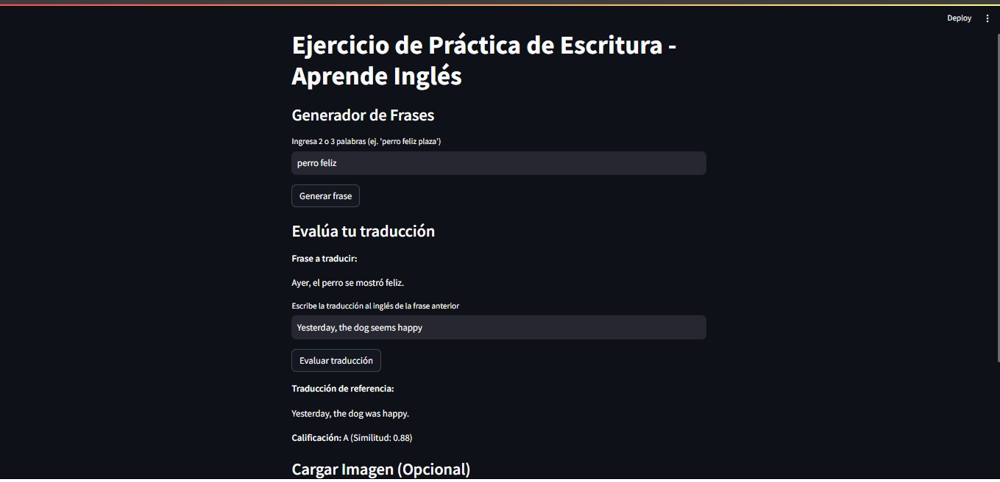

# Writing Practice App - Learn English

This is a prototype application developed to practice writing and translation of sentences into English from Spanish keywords. The app allows you to generate a sentence in Spanish, evaluate the user's translation into English, and, optionally, work with images to extract text using OCR.



## Features

- **Sentence Generator:**  
  Enter 2 or 3 Spanish words and the app generates a simple sentence that includes those words.
  
- **Translation Evaluation:**  
  Once the sentence is generated, the user writes their translation into English, and the app evaluates the quality by comparing it with a reference translation using a translation model (Helsinki-NLP/opus-mt-es-en). A grade (A, B, or C) is assigned based on the similarity.

- **Image Upload (optional):**  
  Allows you to upload and display images. Optionally, you can extract text from the image using OCR, which can be useful for working with texts in Spanish or Japanese.

## Requirements

- **Hardware:**  
  - Processor: AMD Ryzen 5 5600G (4.20 GHz)
  - RAM: 16 GB (10.8 GB usable)
  - Operating System: Windows 11 Pro

- **Software:**  
  - Python 3.12 (or higher)
  - [Ollama](https://ollama.com/) (optional, if you want to integrate it to generate sentences or evaluate translations with local models)

## Dependencies

The project uses the following open source libraries:
- [Streamlit](https://streamlit.io/)
- [Transformers](https://huggingface.co/transformers/)
- [Pillow](https://python-pillow.org/)
- [pytesseract](https://pypi.org/project/pytesseract/) *(optional for OCR)*
- [sentencepiece](https://github.com/google/sentencepiece)

All dependencies are listed in the `requirements.txt` file.

## Installation

1. **Clone the repository or download the source code.**

2. **Create a virtual environment (optional but recommended):**

   ```bash
   python -m venv venv
   source venv/bin/activate  # On Linux/Mac
   venv\Scripts\activate     # On Windows
   ```
   
   ```bash
   pip install -r requirements.txt
   ```
   
   ```bash
   streamlit run app.py
   ```